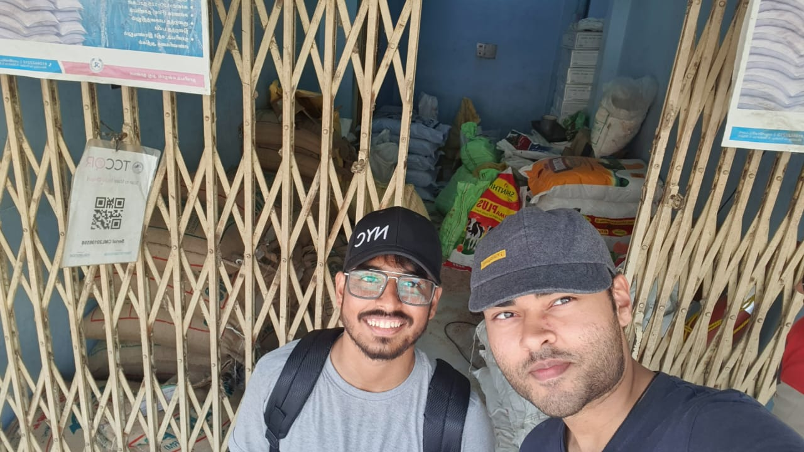
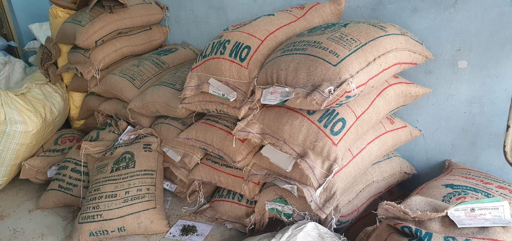
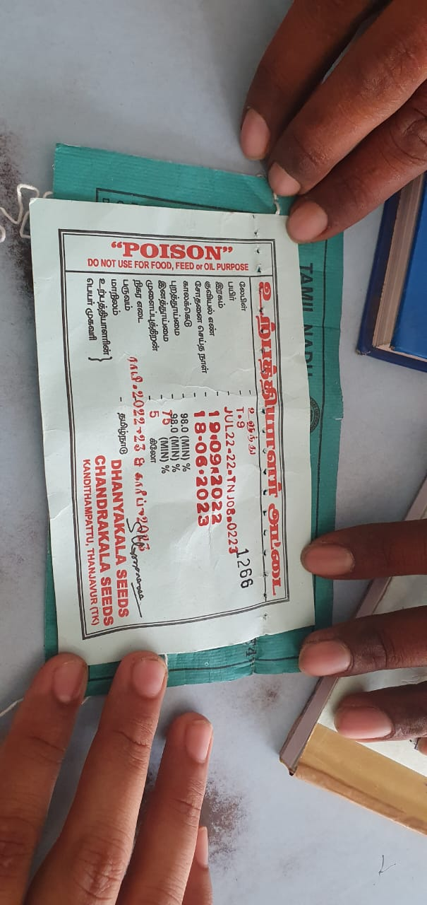
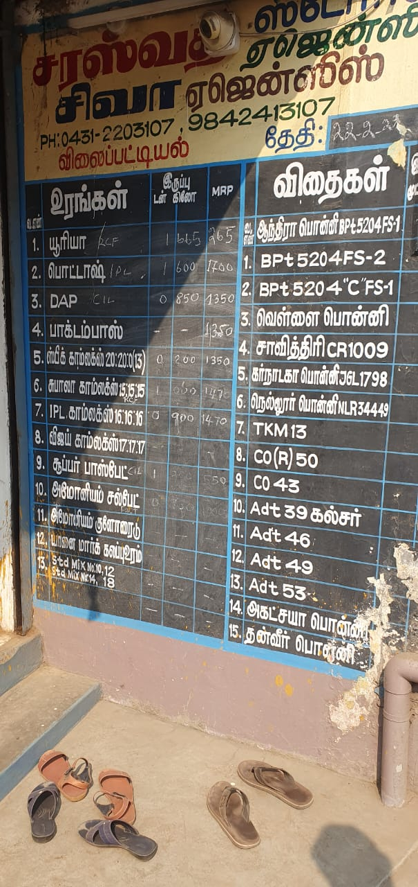
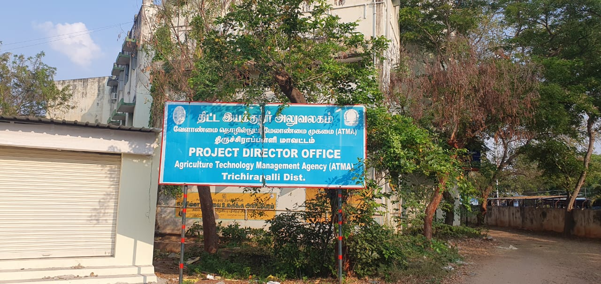
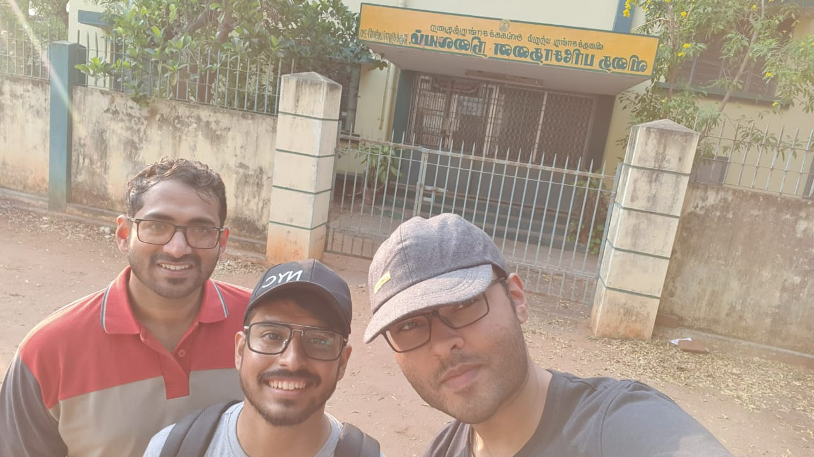

# Classification of Paddy Seeds using Convolutional Neural Networks and Optical Imaging

Improper Paddy Seed classification causes many problems such as variety impurity, rice mutation, or cross-breeding, which may result in poor quality production. In the traditional way, the examination of contamination in breeding seeds has been done by rice experts. Paddy seeds are quite small and are sometimes ambiguous to classify differences between each type. This causes many quality and production issues for rice farmers. Our team, for our final year project, will try our very best to tackle this issue using advance technologies like Computer Vision and Machine Learning.

## Objectives

### Optimal Imaging of paddy seeds:

To setup the required hardware, Camera, Imaging conditions like brightness, wavelength, front/back illumination, etc.

### Attributes to differentiate between seed varieties

CST, Angle features, dimensions of specific parts of the seeds. The attributes need to be quantifiable.

### Classification algorithms

To classify seed varieties based on the attributes and their parametric values, extraction of important features, and implement and use Convolutional Neural Networks.

### Real-time Implementation of classification algorithms

To optimize the codes, tweak the parameters in a matrix and use transfer learning techniques like VGG16, ResNet and HRnet to increase the accuracy of the model.

## Literature Review

We performed a thorough literature survey of the problem at hand. Our goal was to get in-depth, on-foot knowledge of the entire life cycle of paddy seeds, from its cultivation, and distribution, all the way to its sowing.

### For the first step, we started by gathering information about Trichy's local farmers' market

  
&nbsp; &nbsp; &nbsp; &nbsp;
  

### We then visited the Gandhi market, late after noon to have a talk with the paddy seed venders

  
&nbsp; &nbsp; &nbsp; &nbsp;
  

According to the information given to us, the shop owners buy paddy seeds from vendors who in turn buy them directly from the government. While purchasing from the government, they are given a certificate, certifying the type and quality of the paddy seed. The vendors put a slip on each sack containing the details like date of packaging, expiration date, vigor, and storability. As the seeds are certified, the farmers trusted the process blindly and do not question the process of seed classification.

### To know details about the certification process, we visited the Agriculture Technology Management Agency (AMTA) of Trichy

  
&nbsp; &nbsp; &nbsp; &nbsp;
   

From what we found out, in the labs samples are collected from large quantity of paddy seeds (in 1000's of kgs) and analysed for quality with a lot of human intervention.

## Conclusion

Having a classification model for paddy seeds would help save time and analyse more samples for their quality.
