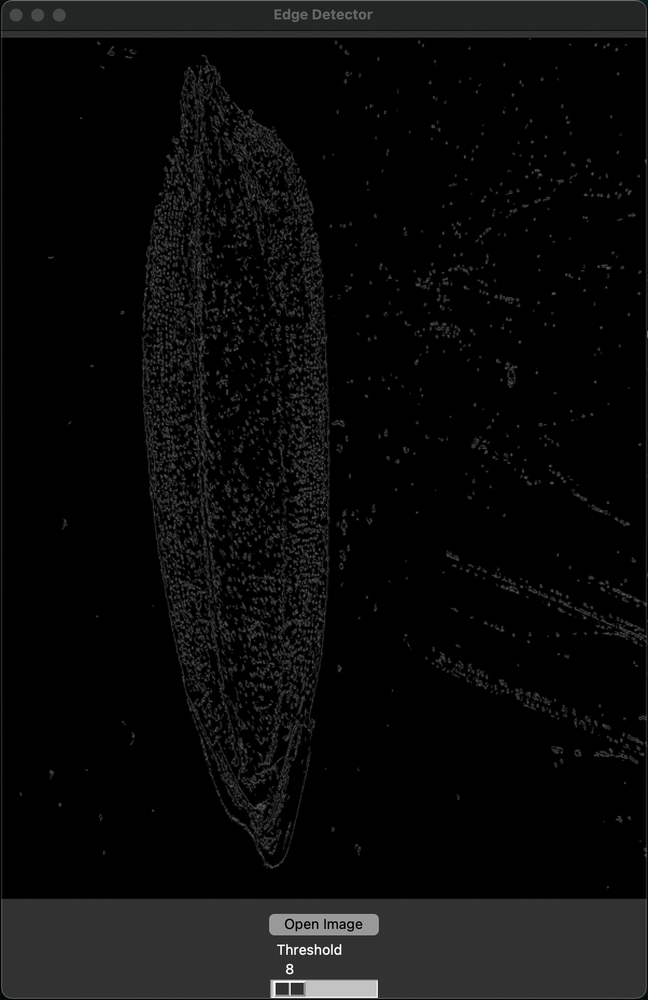

# Edge Detection

Developed in python, this GUI application can be used to determine the threshold for Canny Edge Detection to get proper countours of the image.



To run:

Install the required dependencies:

```python
python3 -m pip install -r requirements.txt
```

```python
python3 edge_detection.py
```
