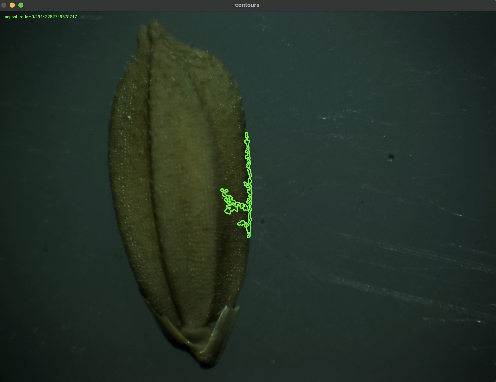

# Feature Extraction

## Objective

To draw proper contour of the paddy seed to extract features such as aspect ratio, angle etc.

## Results

 

## Challenges

Drawing proper contours for images of different brighntess, contrast etc.

