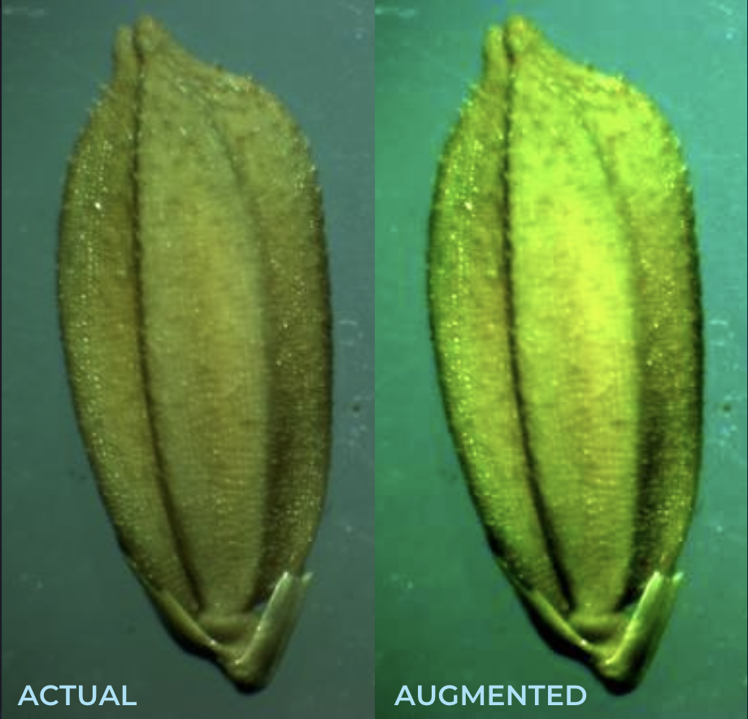

# Image Augmentation

Image augmentation is a technique that is used to artificially expand the data-set. This is helpful when we are given a data-set with very few data samples.
Developed in python, this script changes the following features of actual image to generate new images:

1. Brightness
2. Contrast
3. Sharpness
4. Hue

 

To run:

Install the required dependencies:

```python
python3 -m pip install -r requirements.txt
```

```python
python3 script.py
```
