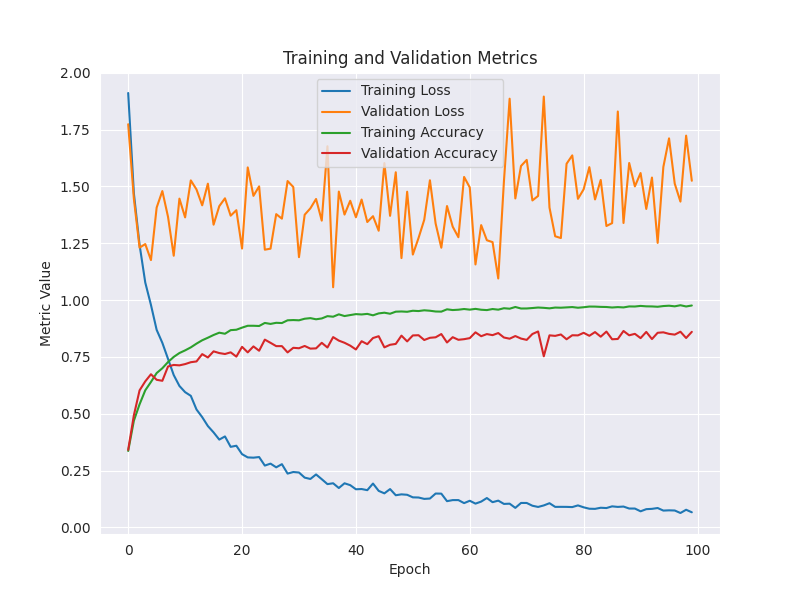

# CNN Model Optimization

Results for trained model metric on different parameters (batch_size, second last layer dense neurons):

- Result for batch size 32 and 64 with 128 neurons in second last dense layer:

  
&nbsp; &nbsp; &nbsp; &nbsp;
   

- Result for batch size 32 and 64 with 256 neurons in second last dense layer:

  
&nbsp; &nbsp; &nbsp; &nbsp;
   

## Inference

From the above four metric, the optimal parameters for training the model should be:

1. Batch size - 64
2. Epochs - 30
3. Dense layer neurons - 256
